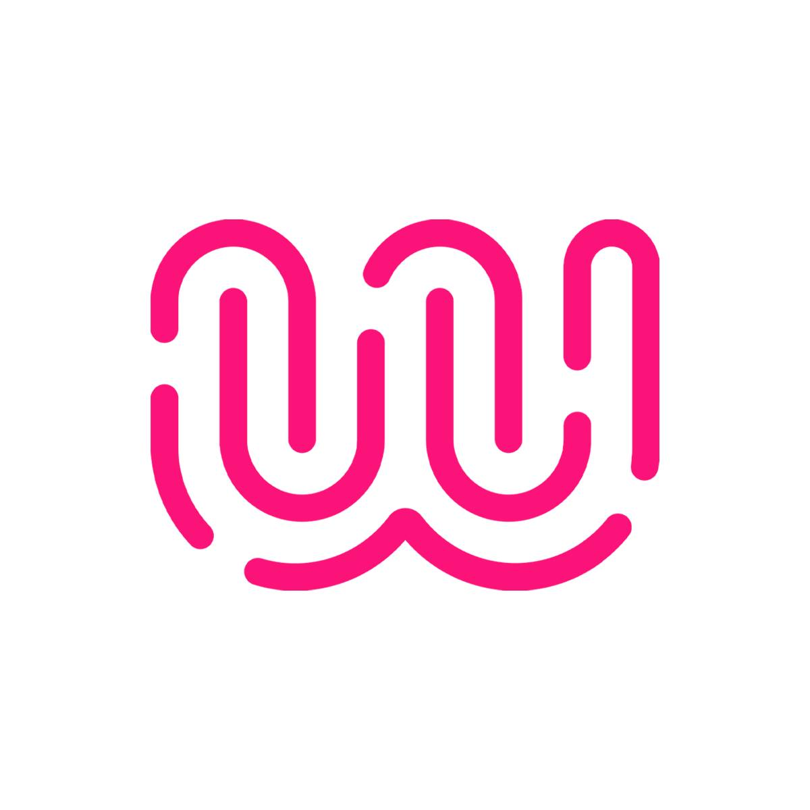

## Sommaire 

- [🎯 Présentation du projet](#presentation-du-projet)
- [📜 Introduction](#introduction)
- [👥 Membres du groupe par sprint](#membres-du-groupe-par-sprint)
- [⚙️ Choix Techniques](#choix-techniques)
- [🧗Difficultés rencontrées](#difficultes-rencontrees)
- [💡 Solutions trouvées](#solutions-trouvees)
- [🚀 Améliorations possibles](#ameliorations-possibles)

# 🎯 Présentation du projet

**Sujet choisi**

**Présentation**

**Objectifs finaux**

# 📜 Introduction

# 👥 Membres du groupe par sprint

**Sprint 1**

| Membre   | Rôle       | Missions |
| -------- | ---------- | -------- |
| membre 1 | PO         | -        |
| membre 2 | SM         | -        |
| membre 3 | Technicien | -        |
| membre 4 | Technicien | -        |

**Sprint 2**

| Membre   | Rôle       | Missions |
| -------- | ---------- | -------- |
| membre 1 | Technicien | -        |
| membre 2 | Technicien | -        |
| membre 3 | PO         | -        |
| membre 4 | SM         | -        |

# ⚙️ Choix techniques

**Matériel**

**Logiciel**

# 🧗 Difficultés rencontrées

# 💡 Solutions trouvées

# 🚀 Améliorations possibles

